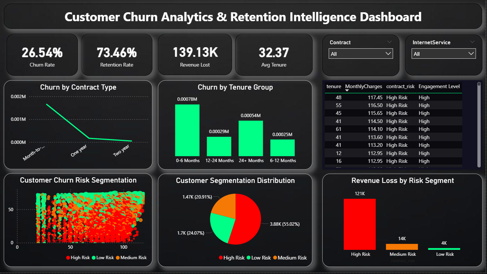

# Customer Churn Analytics & Retention Intelligence System

##  Overview

This project is an end-to-end **Customer Churn Analytics System** designed to identify high-risk customers, predict churn probability, and provide actionable business insights to improve retention strategies.

The system simulates real-world use cases from telecom and subscription-based companies like Netflix, Airtel, and SaaS platforms.

---

##  Business Problem

Companies face significant revenue loss due to customer churn. Without early detection:

* High-value customers leave unnoticed
* Retention campaigns are inefficient
* Revenue leakage increases

This project helps:

* Identify customers likely to churn
* Understand key churn drivers
* Optimize retention strategies

---

##  Tech Stack

* **Python** → Data Cleaning, Feature Engineering, Machine Learning
* **SQL** → Business Analysis & Aggregations
* **Power BI** → Interactive Dashboard & Visualization

---

##  Project Workflow

### 1. Data Cleaning & Preprocessing

* Handled missing values (TotalCharges)
* Converted categorical variables into numerical format
* Prepared dataset for analysis and modeling

---

### 2. Exploratory Data Analysis (EDA)

* Identified churn distribution patterns
* Analyzed churn by contract, tenure, and pricing
* Discovered early churn behavior in new customers

---

### 3. Feature Engineering

* Created **tenure groups** for lifecycle analysis
* Built **engagement score** based on services usage
* Defined **risk segments** (High, Medium, Low)

---

### 4. SQL Analysis

* Calculated churn rate by customer segments
* Identified revenue loss due to churn
* Performed business-level aggregations

---

### 5. Machine Learning Models

* Logistic Regression (baseline model)
* Random Forest (advanced model)

Focus:

* Optimized for **Recall** to capture maximum churn customers

---

### 6. Power BI Dashboard

Designed an interactive dashboard with:

* KPI Cards (Churn Rate, Retention Rate, Revenue Loss)
* Churn Analysis by Contract & Tenure
* Customer Risk Segmentation (Scatter Plot)
* Revenue Loss by Risk Segment
* High-Risk Customer Identification Table

---

##  Dashboard Preview

---

##  Key Insights

* Customers with **month-to-month contracts** have highest churn
* Majority churn occurs in **first 6 months**
* **High monthly charges** increase churn probability
* **Low engagement users** are high-risk customers
* High-risk segment contributes most to revenue loss

---

##  Business Impact

* Enables proactive retention strategies
* Reduces customer acquisition costs
* Improves customer lifetime value (CLV)
* Supports data-driven decision making

---

##  Resume Highlights

* Built end-to-end Customer Churn Analytics & Retention Intelligence System
* Applied feature engineering and ML models to predict churn risk
* Designed Power BI dashboard for real-time business insights

---

##  Future Improvements

* Add real-time churn prediction API
* Implement A/B testing for retention strategies
* Integrate customer feedback data

---

##  Author

Samudrala Vijayendra Varma
